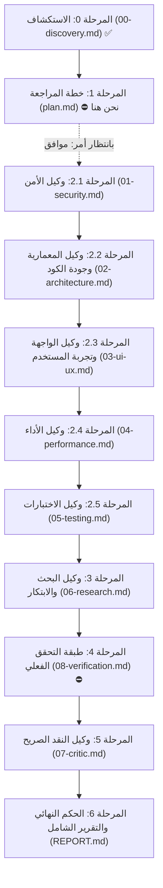

# مرحلة 1: خطة المراجعة والتقييم الشاملة (Review Execution Plan)

**تاريخ الخطة:** 2026-09-30  
**المشرف العام:** رئيس فريق هندسة البرمجيات والمراجعة الفنية (Chief Project Supervisor)

---

## 1. تحديد نطاق الفحص وتخصيص الوكلاء (Agent Activation & Scope)

استناداً إلى نتائج استكشاف المشروع في المرحلة 0 (نظام طبي مكتبي وهجين LIMS مبني بـ Electron + Next.js 14 + SQLite)، تم تخصيص وتفعيل الوكلاء وفق الجدول التالي:

| الوكيل المتخصص | الحالة | النطاق والمحاور المستهدفة | الملف المخصص |
|---|---|---|---|
| **1. وكيل الأمن (Security)** | **مفعّل** | مراجعة أمان التراخيص والأسرار (HMAC Secret)، حماية نقاط API، أمان اتصالات الشبكة المحلية LAN، ثغرات حقن الاستعلامات، أمان عمليات IPC في Electron | `.review/01-security.md` |
| **2. وكيل المعمارية وجودة الكود (Architecture & Code)** | **مفعّل** | فحص ازدواجية مخزن البيانات (SQLite vs JSON Store)، تنظيم مسارات الـ API (44 مساراً)، هيكلية معالجات أجهزة التحليل ASTM، مبادئ SOLID و DRY في الحسابات الطبية | `.review/02-architecture.md` |
| **3. وكيل واجهة وتجربة المستخدم (UI/UX)** | **مفعّل** | تدقيق دعم اللغة العربية والـ RTL، بيئة العمل المخبرية وسرعة الإدخال (Ergonomics / Keyboard Shortcuts)، تجاوب الشاشات الطبية، التباين وسهولة قراءة القيم الحرجة | `.review/03-ui-ux.md` |
| **4. وكيل الأداء (Performance)** | **مفعّل** | استهلاك الذاكرة لمحرك Standalone داخل Electron، كفاءة استعلامات قاعدة بيانات SQLite في نمط WAL، سرعة توليد تقارير الـ PDF، زمن الإقلاع البارد (Cold Start) | `.review/04-performance.md` |
| **5. وكيل الاختبارات (Testing)** | **مفعّل** | تحليل تغطية الاختبارات الحالية، فحص موثوقية معادلات التحاليل (الدهون، البيليروبين، الدم العام، دلتا تشيك)، اختبارات المحاكاة لأجهزة ASTM | `.review/05-testing.md` |
| **6. وكيل البحث والابتكار (Research)** | **مفعّل** | البحث في أحدث أدوات LIMS وأنظمة الطباعة المباشرة لعام 2025/2026، مكتبات مزامنة البيانات المحلية (Local-First Sync)، وتحديثات أمان بيئة Electron | `.review/06-research.md` |
| **7. طبقة التحقق والاختبار الفعلي (Verification)** | **مفعّل** | تدقيق كل ملاحظة بالأدلة القاطعة (مسار ورقم السطر)، تشغيل فحوصات الأكواد والبناء، وإلغاء أي إنذارات كاذبة | `.review/08-verification.md` |
| **8. وكيل النقد الصريح (Devil's Advocate)** | **مفعّل** | النقد الراديكالي من زاوية طبيب مخبري متطلب، مخترق محلي، ومستثمر، وتحديد أسوأ السيناريوهات المحتملة عند مضاعفة الحمل | `.review/07-critic.md` |
| **9. المشرف العام (Final Report)** | **مفعّل** | تجميع الحكم النهائي، بطاقة التقييم الرقمية، وخارطة طريق الإصلاحات العاجلة والمتوسطة | `.review/REPORT.md` |

---

## 2. الوكلاء والمسارات المُستبعدة مع التعليل (Excluded Scopes)
- **وكيل الحوسبة السحابية و Kubernetes/Terraform:** مُستبعد لكون النظام مصمماً للعمل محلياً دون إنترنت (Offline-First / Windows On-Premise) في المختبرات الطبية، وليس كخدمة سحابية متعددة المستأجرين (Public Multi-Tenant SaaS).

---

## 3. تسلسل ومراحل التنفيذ (Execution Workflow)

---

## 4. شروط وضوابط التنفيذ
1. **الالتزام بالقراءة فقط:** عدم تعديل أو حذف أي ملف من ملفات النظام البرمجية.
2. **الأدلة الإلزامية:** توثيق كل ملاحظة بـ `مسار الملف:رقم السطر` ومقتطف الكود الحقيقي.
3. **التوثيق المستقل:** كتابة كل مرحلة في ملفها المخصص داخل مجلد `.review/` دون حشو المحادثة.
4. **التوقف الإلزامي:** التوقف عند المرحلة 1 الحالية وانتظار أمر "موافق" من المشرف للانتقال إلى المرحلة 2.
