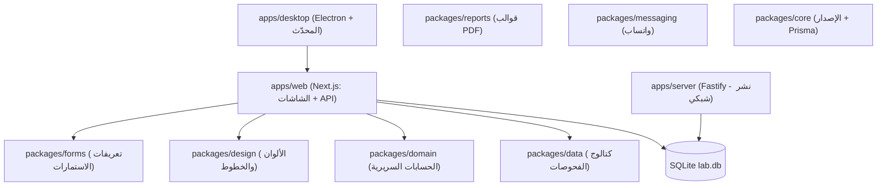

# هيكل النظام (ARCHITECTURE)

النظام عبارة عن تطبيق سطح مكتب (`Electron`) يشغّل بداخله تطبيق الويب (`Next.js standalone`) مع قاعدة بيانات محلية (`SQLite` عبر `Prisma`). يوجد أيضاً خادم مستقل (`apps/server` – `Fastify`) يُستخدم للنشر الشبكي.

## الطبقات واتجاه الاعتماد
`modules/apps → forms / reports / design / domain → data / core` — ولا يُسمح بالاتجاه المعاكس. يفرض ذلك الأمر `npm run lint:boundaries`.

| الطبقة | المسار | الحالة الفعلية |
|---|---|---|
| البيانات | `packages/data` | ✅ مصدر الكتالوج الوحيد (الملف القديم أصبح إعادة تصدير) |
| الحسابات | `packages/domain` | ✅ مصدر `clinicalIntelligence` الوحيد |
| التصميم | `packages/design` | 🟡 الرموز والمكونات جاهزة، لم تُربط بالشاشات بعد |
| الاستمارات | `packages/forms` | 🟡 ملفات التعريف والمحرك جاهزة، الاستمارات الحالية لم تُحوَّل بعد |
| التقارير | `packages/reports` | 🟡 نسخة منظمة؛ الخادم ما زال يستخدم `apps/server/src/utils/pdf.ts` (انظر القرارات) |
| الرسائل | `packages/messaging` | 🟡 أدوات التنسيق فقط؛ خدمة واتساب ما زالت في الخادم |
| النواة | `packages/core` | 🟡 الإصدار وعميل Prisma |

