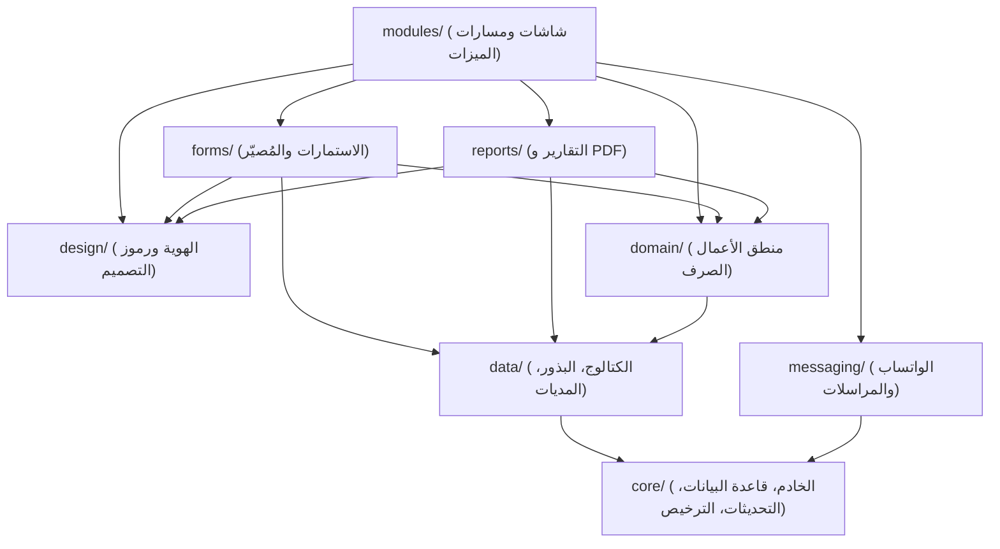

# المخطط المعماري وخريطة ملكية الملفات (ARCHITECTURE_PLAN.md)
نظام إدارة المختبرات الطبية (Labryo LIMS Monorepo)

تحدد هذه الوثيقة الهيكل المعماري الصارم، وقواعد تدفق الاعتماديات (Dependency Flow)، ونطاق التأثير المصغر (Blast Radius)، وملكية الملفات المستقلة لكل وكيل برمجي.

---

## 1. الهيكل المستهدف للطبقات (Layered Architecture)

### قواعد تدفق الاعتماديات الصارمة:
- الاتجاه الإلزامي: `modules` → `forms / reports / design / domain / messaging` → `data` → `core`.
- يُحظر تماماً الاعتماد العكسي (Core لا يستورد من Modules، و Domain لا يستورد من UI أو DB).
- خلو طبقة `domain/` من أي استيراد لقواعد البيانات أو واجهات المستخدم لتكون قابلة للاختبار المعزول بنسبة 100%.

---

## 2. جدول ملكية الملفات (File Ownership Map)

| الوكيل (Agent) | الحزمة / المجلد المملوك | المسؤولية الحصرية | المسارات المحظورة |
|---|---|---|---|
| **CORE** | `packages/core/`, `apps/server/`, ملفات التكوين بالجذر (`package.json`, `tsconfig.json`) | إقلاع الخادم، مستودعات قاعدة البيانات (Prisma Repositories)، نظام الترخيص، خدمة التحديثات (Updater)، النسخ الاحتياطي | واجهات المستخدم، استمارات الفحوصات، قوالب التقارير |
| **CATALOG-DATA** | `packages/data/`, `data/`, بذور الفحوصات والمديات المرجعية | كتالوج الفحوصات، مديات المراجع السريرية، البذور المعيارية، سكريبتات الدمج وتنقية التكرارات | منطق الخادم الأساسي، كود التصميم |
| **FORMS** | `packages/forms/` (`definitions/` + `renderer/`) | تحويل استمارات الفحوصات (CBC, Urine, Stool, Chemistry...) إلى ملفات JSON/Data ومحرك العرض الموحد ومكونات الإدخال | استعلامات Prisma المباشرة، تصميم الشاشات العامة |
| **DESIGN** | `packages/design/` | رموز التصميم (Design Tokens: الألوان، المسافات، الخطوط)، قواعد RTL، الثيمات (Light/Dark)، مكونات الـ UI Kit العامة | منطق الأعمال الطبي، استعلامات البيانات |
| **REPORTS** | `packages/reports/` | قوالب الطباعة الخمسة (Classic, Modern, Executive, Compact, Black&White)، محرك PDF عبر Puppeteer، بناء بيانات التقرير والـ QR | نماذج إدخال البيانات، إدارة الأجهزة |
| **MESSAGING** | `packages/messaging/` | خدمة الواتساب عبر Baileys، بناء وإرسال الرسائل وتأكيد التسليم | تعديل قوالب الطباعة أو بيانات المرضى |
| **DOMAIN** | `packages/domain/` | حسابات الدهون (Lipid Ratios)، مطابقة المديات المرجعية، شروط اكتمال العينات والأسعار الصرفة | واجهات المستخدم، Prisma DB |
| **QA** | `tests/` | الاختبارات الذهبية، اختبارات الحدود، مدقق النطاق `check:scope`، وله سلطة الفيتو | كتابة كود الميزات الإنتاجية |
| **SIZE** | `tools/size/` | ميزانيات الحجم، فحص الاعتماديات غير المستخدمة، ضبط حزم Standalone | تعديل منطق الأعمال |
| **DOCS** | التوثيق والجذر (`docs/`, `*.md`) | أدلة الاستخدام، دليل التغيير لغير المبرمجين، توجيهات الوكلاء المستقبليين | أي كود برمجي تنفيذي |

---

## 3. خريطة التأثير المصغر (Blast Radius Change Map)

| نوع التعديل المطلوب | المجلد الحصري المسموح بتعديله | أداة الفحص الإلزامية |
|---|---|---|
| تعديل حقل أو خيار في استمارة فحص (Urine/Stool/CBC) | `packages/forms/definitions/` فقط | `npm run check:scope -- forms` |
| تعديل ألوان أو خطوط أو مسافات في الواجهة | `packages/design/` فقط | `npm run check:scope -- design` |
| تعديل مظهر أو تنسيق تقرير الطباعة | `packages/reports/templates/` فقط | `npm run check:scope -- reports` |
| تعديل صياغة رسالة الواتساب التلقائية | `packages/messaging/` فقط | `npm run check:scope -- messaging` |
| تعديل معادلة حسابية طبية | `packages/domain/` فقط | `npm run check:scope -- domain` |
| إضافة فحص أو تحديث مديات مرجعية | `packages/data/` فقط | `npm run check:scope -- data` |
| تعديل النصوص والترجمة العربية | `packages/i18n/` فقط | `npm run check:scope -- i18n` |

---

## 4. الواجهات العامة الموحدة (Public Interfaces)

- يُمنع الاستيراد من المسارات الداخلية لأي طبقة مباشرة؛ يتم التعامل حصرياً عبر ملف المدخل الموحد `index.ts` لكل حزمة.
- يتم ترك حشوات إعادة التصدير المؤقتة (Re-export Shims) في المسارات القديمة لضمان عدم كسر أي كود قيد البناء حتى اكتمال الدمج النهائي.
